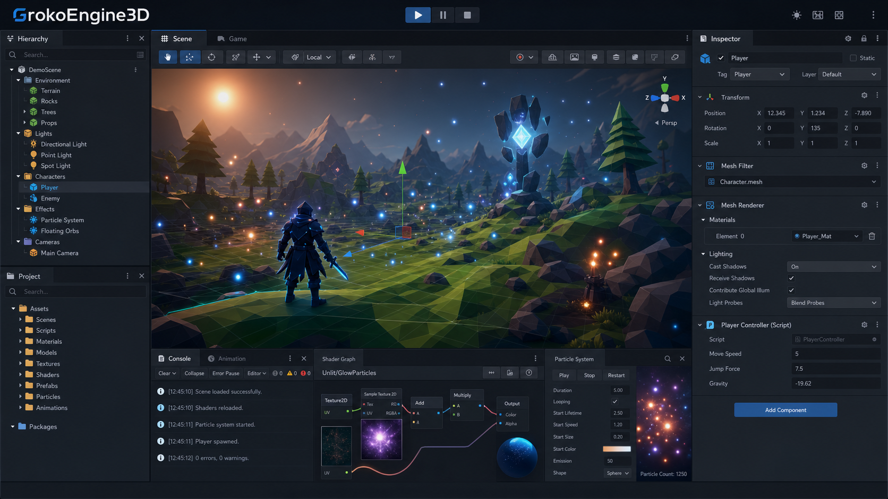

# GrokoEngine3D

GrokoEngine3D is an experimental 3D engine and editor created by Gerar Gonzalez. It is currently in active development and built in C# with a workflow inspired by modern game engines such as Unity.

This project is an early experimental version of a custom game engine. Features, architecture and tools may change frequently while the engine continues to evolve.

## Demo Video

Watch the experimental preview on YouTube:

The project includes a visual editor, scene hierarchy, inspector, project browser, component system, physics, animation, particles, materials, shader graph tools and real-time rendering.

## Features

- Unity-style editor workflow with Scene View, Game View, Inspector, Hierarchy and Project Panel.
- GameObject and component-based architecture.
- Transform, cameras, lights, materials and prefab support.
- 3D asset import pipeline with mesh, texture and material handling.
- Particle system with modules, gradients, curves, mesh/prefab rendering and reusable presets.
- Physics with Rigidbody, Colliders and Character Controller.
- Animation system, Animator Controller and Blend Trees.
- Visual Shader Graph tooling.
- Real-time rendering with lighting, shadows, environment/sky and post-processing foundations.
- Scene and asset serialization.
- Automated tests covering core engine/editor behavior.

## Goal

GrokoEngine3D is a learning, research and prototyping project focused on building a custom game engine/editor from the ground up.

It is not intended to replace commercial engines yet. Instead, it is a technical playground for experimenting with rendering, physics, editor tooling, asset workflows, scripting, animation and visual systems.

## Technology

- C#
- .NET
- OpenTK / OpenGL
- ImGui.NET
- BepuPhysics
- Assimp-based model importing

## Status

GrokoEngine3D is an experimental engine in active development, created by Gerar Gonzalez.

Current builds compile successfully and include automated validation tests, but many systems are still evolving. This repository should be treated as a development version, not a finished production engine.

## Community and Feedback

If you try GrokoEngine3D, your feedback helps the project grow.

- Star the repository if you want to support the project.
- Open an issue if you find a bug or have a feature idea.
- Fork the project if you want to experiment with the engine.
- Share screenshots, videos or demos made with GrokoEngine3D.
- Mention the repository if you use the engine in a test project or learning experiment.

This helps track interest in the engine and shows where the project should improve next.

## License

This project is licensed under the MIT License. See [LICENSE](LICENSE) for details.
